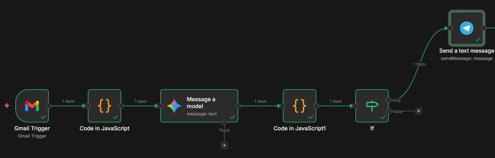

# Detector Automático de Phishing con n8n

## 1. Descripción del incidente

Este sistema detecta **posibles correos de phishing** de forma automática. El phishing consiste en correos fraudulentos diseñados para engañar al usuario y obtener información sensible como contraseñas, datos bancarios o credenciales.

El workflow analiza automáticamente los correos recibidos en Gmail buscando **indicadores de phishing** mediante:

* análisis técnico del correo
* análisis con inteligencia artificial
* generación automática de alertas

Cuando se detecta un correo sospechoso, el sistema envía una alerta para permitir una respuesta rápida ante el posible incidente.

---

# 2. Lógica de detección

El workflow en **n8n** sigue este flujo:

Gmail Trigger → Extracción de datos → Análisis técnico → Análisis con IA → Evaluación del riesgo → Alerta en Telegram

### Recepción del correo

Un nodo **Gmail Trigger** monitoriza la bandeja de entrada y ejecuta el workflow cuando llega un nuevo correo.

### Extracción de información

Un nodo **Code (JavaScript)** extrae datos relevantes:

* remitente
* dominio del remitente
* reply‑to
* asunto
* contenido del mensaje
* URLs del correo

### Análisis técnico

El sistema analiza indicadores típicos de phishing:

* palabras sospechosas (urgente, login, cuenta, verifique)
* URLs en el correo
* dominios sospechosos o typosquatting
* diferencia entre dominio del remitente y URLs
* TLD sospechosos (.ru, .xyz, .tk)

Cada indicador aumenta una puntuación técnica que determina un **riesgo preliminar** (bajo, medio o alto).

### Análisis con Inteligencia Artificial

Los datos del correo se envían a un modelo de IA (Gemini) que evalúa el contenido y devuelve un JSON con:

* nivel de riesgo
* puntuación
* indicadores detectados
* resumen del análisis
* acción recomendada

### Evaluación del riesgo

Un nodo **IF** comprueba el valor del campo `risk`.

Si el riesgo es **alto**, el workflow continúa hacia el sistema de alerta.

---

### Sistema de alertas

Cuando se detecta riesgo alto, el sistema envía una **alerta automática a Telegram** con información del correo:

* remitente
* asunto
* URLs detectadas
* nivel de riesgo
* resumen del análisis

---

# 3. Justificación de los criterios

Los criterios utilizados se basan en técnicas reales de detección de phishing:

* lenguaje de urgencia para presionar al usuario
* enlaces sospechosos
* suplantación de marcas conocidas
* inconsistencias entre dominios

El uso de inteligencia artificial permite detectar patrones más complejos y reducir falsos positivos.

---

# 4. Cómo probar el workflow

1. Importar el workflow en n8n.
2. Configurar credenciales:

* Gmail OAuth2
* Google Gemini API
* Telegram Bot

3. Activar el workflow.

4. Enviar un correo de prueba.

Ejemplo:

**Asunto**

Urgente: verifique su cuenta de PayPal

**Contenido**

Su cuenta será suspendida. Acceda ahora a [http://paypal-alerts-login.com](http://paypal-alerts-login.com)

Resultado esperado:

* detección de palabras de urgencia
* suplantación de marca
* URL sospechosa

El sistema clasificará el correo como **riesgo alto** y enviará una alerta a Telegram.

---

# 5. Posibles mejoras

El sistema podría mejorarse mediante:

* integración con APIs de reputación (VirusTotal, AbuseIPDB)
* modelos de detección de phishing más avanzados
* cuarentena automática de correos sospechosos
* panel de monitorización de incidentes

---

# 6. Captura del workflow

---

Autor: Abel Sánchez Ramos  
Asignatura: Incidentes de Ciberseguridad  
Fecha: 03‑03‑2026
